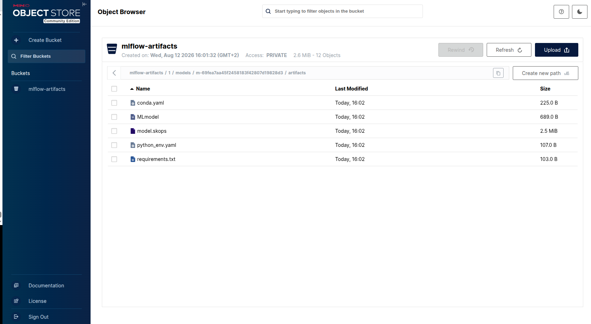
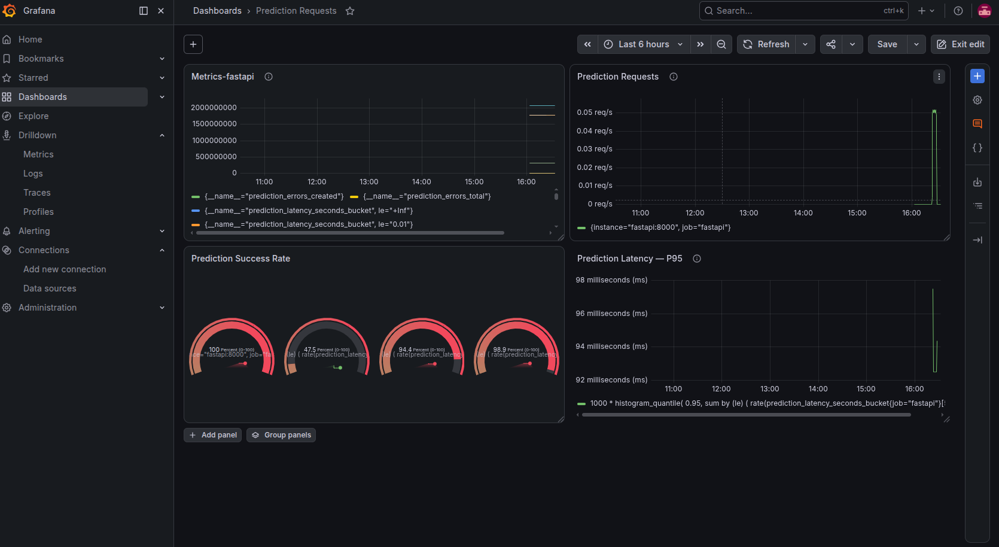
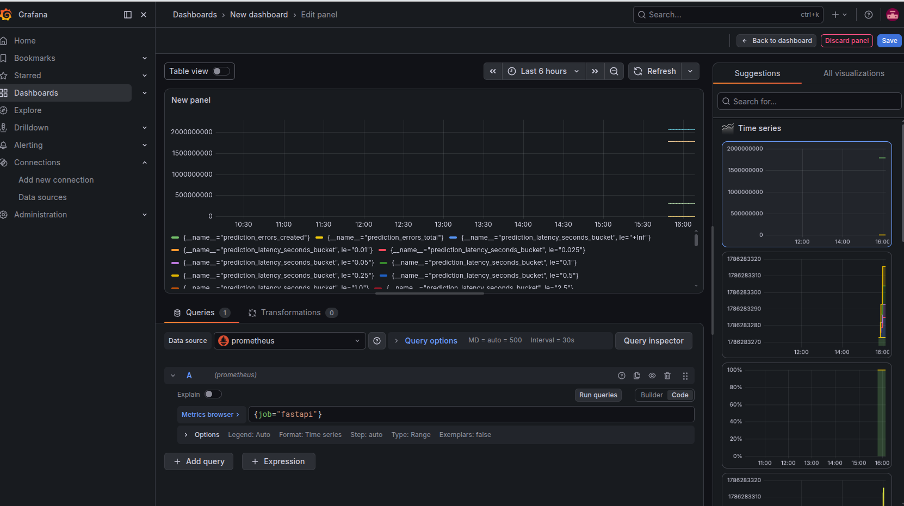

# breast-cancer-mlops


This MLOps project provides an end-to-end workflow for building, evaluating, serving, and monitoring a machine learning model that classifies breast cancer using the Wisconsin Breast Cancer dataset. The model is trained using scikit-learn's Random Forest classifier, with data validation, preprocessing, model evaluation, and experiment tracking integrated into the training pipeline. MLflow is used to track experiments and manage the trained model, while a FastAPI application provides REST endpoints for health checks, model information, and breast cancer predictions. The prediction service loads the registered MLflow model through a dedicated model loader and returns both the predicted class and prediction probabilities. Prometheus is integrated to collect application and prediction metrics, with Grafana providing monitoring and visualization dashboards. The application is containerized with Docker and supported by automated testing and GitHub Actions-based CI/CD, providing a foundation for deployment to cloud infrastructure.


                                                  
                         ┌─────────────────┐
                         │     Client      │
                         └────────┬────────┘
                                  │
                                  ▼
                         ┌─────────────────┐
                         │    FastAPI      │
                         │   API Runtime   │
                         └────────┬────────┘
                                  │
             ┌────────────────────┼────────────────────┐
             ▼                    ▼                    ▼
         /health             /predictions            /model
             │                    │                    │
             │                    ▼                    │
             │             ┌─────────────┐             │
             │             │  Predictor  │             │
             │             └──────┬──────┘             │
             │                    │                    │
             │                    ▼                    │
             │             ┌─────────────┐             │
             │             │ ModelLoader │             │
             │             └──────┬──────┘             │
             │                    │                    │
             │                    ▼                    │
             │             ┌─────────────┐             │
             └────────────►│   MLflow    │◄────────────┘
                           │  Registry   │
                           └──────┬──────┘
                                  │
                    ┌─────────────┴─────────────┐
                    ▼                           ▼
             ┌──────────────┐            ┌──────────────┐
             │ PostgreSQL   │            │    MinIO     │
             │ Model/Run    │            │  Artifacts   │
             │ Metadata     │            │              │
             └──────────────┘            └──────────────┘


        ┌──────────────────────────────────────────────┐
        │              MODEL BOOTSTRAP                 │
        │           Initialization / Setup             │
        │                                              │
        │  Check model alias assigned                  │
        │        │                                     │
        │        ├── exists ─────────► Done            │
        │        │                                     │
        │        └── missing                           │
        │              │                               │
        │              ▼                               │
        │        Train model                           │
        │              │                               │
        │              ▼                               │
        │        Register model                        │
        │              │                               │
        │              ▼                               │
        │        Assign model alias                    │
        │              │                               │
        │              ▼                               │
        │            Done                              │
        └──────────────────────────────────────────────┘
                              │
                              ▼
                         MLflow Registry


             ┌───────────────────────────────┐
             │          Monitoring           │
             │                               │
             │ FastAPI ──► Prometheus        │
             │                  │            │
             │                  ▼            │
             │               Grafana         │
             └───────────────────────────────┘


---

## Table of Contents

- [Project Overview](#project-overview)
- [Features](#features)
- [Technology Stack](#technology-stack)
- [Installation](#installation)
- [Usage](#usage)
- [API Endpoints](#api-endpoints)
- [Monitoring](#monitoring)
- [CI/CD Pipeline](#cicd-pipeline)
- [Deployment](#deployment)
- [Development](#development)
- [Contributing](#contributing)
- [License](#license)

---

## Project Overview

This project implements an end-to-end MLOps workflow for breast cancer classification using the Wisconsin Breast Cancer dataset. It covers the main stages of the machine learning lifecycle, including data loading and validation, preprocessing, model training, evaluation, experiment tracking, model registration, API serving, testing, and monitoring.

The machine learning model is built with scikit-learn using a Random Forest classifier and tracked with MLflow. The trained model is registered and served through a dedicated model-loading service that resolves the configured MLflow model alias. A FastAPI REST API exposes endpoints for health checks, model information, and breast cancer predictions, returning both the predicted class and prediction probabilities.

For observability, the application exposes Prometheus metrics covering prediction requests, successful predictions, prediction errors, prediction latency, and predictions by class. Grafana is used to visualize these metrics through monitoring dashboards. The application is containerized with Docker, while automated unit and integration tests provide validation of the prediction service and API. GitHub Actions is used for CI/CD automation, providing the foundation for future cloud deployment.

The current architecture uses MLflow with a local SQLite backend and local model artifacts for development. Cloud infrastructure such as PostgreSQL, object storage, and AWS ECS/Fargate deployment can be introduced as part of the production deployment stage.


```
breast-cancer-mlops/
│
├── app/                                  # Production FastAPI application
│   ├── api/
│   │   ├── main.py                       # FastAPI application entry point
│   │   └── routes/                       # REST API endpoints
│   │       ├── __init__.py
│   │       ├── health.py                 # Health and readiness endpoints
│   │       ├── metrics.py                # Prometheus metrics endpoint
│   │       ├── model.py                  # ML model information endpoint
│   │       └── prediction.py             # Breast cancer prediction endpoint
│   │
│   ├── core/                             # Shared application infrastructure
│   │   ├── config.py                     # Application and environment configuration
│   │   ├── features.py                   # Dataset features and class labels
│   │   ├── logging.py                    # Application logging configuration
│   │   └── metrics.py                    # Prometheus metrics definitions
│   │
│   ├── schemas/                          # Pydantic API contracts
│   │   ├── health.py                     # Health and readiness schemas
│   │   ├── model.py                      # Model information schema
│   │   └── prediction.py                 # Prediction request/response schemas
│   │
│   └── services/                         # Application and ML services
│       ├── model_loader.py               # MLflow model loading and metadata
│       └── predictor.py                  # Prediction and probability generation
│
├── training/                             # End-to-end ML training pipeline
│   ├── __init__.py
│   ├── data_loader.py                    # Dataset loading
│   ├── validate.py                       # Dataset validation
│   ├── split.py                          # Train/test dataset splitting
│   ├── preprocess.py                     # Feature preprocessing
│   ├── model.py                          # ML model construction
│   ├── train.py                          # Training pipeline orchestration
│   ├── evaluate.py                      # Model evaluation and metrics
│   ├── visualization.py                  # Evaluation visualizations
│   ├── mlflow_tracker.py                 # MLflow experiment tracking
│   └── assign_model_alias.py             # MLflow model alias promotion
│
├── tests/                                # Automated test suite
│   ├── unit/
│   │   └── test_predictor.py             # Predictor unit tests
│   └── integration/
│       └── test_prediction_api.py        # Prediction API integration tests
│
├── monitoring/                           # Observability configuration
│   └── prometheus/
│       └── prometheus.yml                # Prometheus scrape configuration
│
├── notebooks/                            # Data exploration and experimentation
│   └── exploratory_analysis.ipynb        # Exploratory data analysis
│
├── reports/                              # Generated analysis and evaluation reports
│   ├── EDA_Report.md                     # EDA summary report
│   │
│   ├── evaluation/                       # Model evaluation results
│   │   ├── classification_report.csv
│   │   ├── confusion_matrix.csv
│   │   ├── metrics.csv
│   │   └── plots/
│   │       ├── confusion_matrix.png
│   │       ├── feature_importance.png
│   │       ├── roc_curve.png
│   │       └── trees_vs_accuracy.png
│   │
│   ├── figures/                          # Generated analysis figures
│   │
│   └── statistics/                       # Statistical analysis results
│       ├── advanced_statistics.csv
│       ├── correlation_matrix.csv
│       ├── dataset_overview.csv
│       ├── dataset_summary.json
│       ├── descriptive_statistics.csv
│       ├── duplicate_analysis.csv
│       ├── feature_information.csv
│       ├── highly_correlated_features.csv
│       ├── iqr_outlier_analysis.csv
│       ├── missing_value_analysis.csv
│       ├── pca_explained_variance.csv
│       ├── pca_projection.csv
│       ├── target_distribution.csv
│       └── zscore_outlier_analysis.csv
│
├── monitoring/                           # Monitoring infrastructure
│   └── prometheus/
│       └── prometheus.yml
│
├── mlflow/
│   └── Dockerfile                        # MLflow server  
│
├── scripts/
│   └── docker_boostrap_model.sh          # Automatically trains the model and assigns the alias if none exists
│
├── .github/
│   └── workflows/
│       └── ci-cd.yml                     # CI/CD automation
│
├── Dockerfile                            # FastAPI application 
├── docker-compose.yml                    
├── .dockerignore                       
│
├── .env                                
├── .env.dev                              # Local environment variables                           
├── .env.example                          
├── .gitignore                            
│
├── pytest.ini                            # Pytest configuration
├── requirements.txt                      # Python dependencies
├── README.md                             
└── LICENSE                               
```


---

## Features

- **Data Pipeline:** Structured data loading and validation for the Wisconsin Breast Cancer dataset, including feature validation and preparation for model training.
- **Model Training:** Scikit-learn Random Forest classifier with preprocessing, train/test splitting, evaluation, and MLflow experiment tracking.
- **Model Management:** MLflow model registration and alias-based model promotion. The FastAPI application dynamically resolves the configured model alias and loads the corresponding model at startup.
- **Prediction Serving:** FastAPI REST API with Pydantic request and response schemas, feature-count validation, prediction probabilities, model metadata, and structured error handling.
- **API Endpoints:** Dedicated endpoints for application health, readiness, model information, predictions, and Prometheus metrics.
- **Testing:** Unit tests for the prediction service and integration tests for the prediction API, covering successful predictions, validation errors, unavailable models, and unexpected failures.
- **Monitoring:** Prometheus metrics for prediction request counts, successful predictions, prediction errors, prediction latency, and predictions by class.
- **Visualization:** Grafana dashboards for monitoring API activity, prediction volume, prediction errors, latency, and model prediction distribution.
- **Containerization:** Docker-based application packaging with Docker Compose support for running the FastAPI application and supporting MLflow and monitoring services locally.
- **CI/CD:** GitHub Actions workflow for automated testing and CI/CD validation, providing the foundation for future container image publishing and cloud deployment.
- **Configuration:** Environment-based application configuration using `.env` files and a dedicated `.env.example` template for reproducible development setup.
- **Logging:** Structured application logging for API requests, model loading, predictions, errors, and MLflow model metadata.

<br>

  

<br>

---
## Technology Stack

| Component              | Technology / Library                                      |
| ---------------------- | --------------------------------------------------------- |
| Programming Language   | Python 3.12                                               |
| Model Training         | scikit-learn, Random Forest, pandas                       |
| Data Processing        | pandas, NumPy                                             |
| Experiment Tracking    | MLflow                                                    |
| Model Management       | MLflow Model Registry, model aliases                      |
| API Framework          | FastAPI, Pydantic                                         |
| API Server             | Uvicorn                                                   |
| Testing                | pytest, HTTPX                                             |
| Metrics                | Prometheus Client                                         |
| Monitoring             | Prometheus, Grafana                                       |
| Containerization       | Docker, Docker Compose                                    |
| CI/CD                  | GitHub Actions                                            |
| Configuration          | Pydantic Settings, environment variables                  |
| Logging                | Python logging                                            |
| Development Environment| Python virtual environment (`.venv`)                      |

---

## Installation

### Prerequisites

- Python 3.12+
- Git
- Docker
- Docker Compose

### Local Setup

1. Clone the repository:

```bash
git clone https://github.com/fermat01/breast-cancer-mlops.git

cd breast-cancer-mlops
```
2. Create the environment configuration

```bash
cp .env.example .env
```
3. Build and start all services

```bash
docker compose up --build
```
4. Check the running containers:
docker compose ps


5. Once the containers are running, the main services are available at:

|     Service           |               URL                    |
| --------------------  | ------------------------------------ |
| FastAPI               | http://localhost:8001                |
| FastAPI Swagger UI    | http://localhost:8001/docs           |
| FastAPI Metrics       | http://localhost:8001/api/v1/metrics |
| MLflow                | http://localhost:5000                |
| Prometheus            | http://localhost:9090                |
| Grafana               | http://localhost:3000                |


6. Verify the application health 

```bash
curl http://localhost:8001/api/v1/health

```
- Expected response:


  {
      "status": "ok",
      "service": "Breast Cancer Machine Learning API",
      "version": "1.0.0"
           }

7. Tests can be executed inside the Python virtual environment:

     ```
     pytest -v
     ```

The test suite contains both unit tests and API integration tests.


---

## Usage

- Send `POST` requests to `//api/v1/predictions` with exactly 30 numerical features in the same order used during model training.
- Access `/health` endpoint to check API health status.

- Example using curl:

```bash
curl -X POST http://localhost:8001/api/v1/predictions \
  -H "Content-Type: application/json" \
  -d '{
    "features": [
      17.99,
      10.38,
      122.8,
      1001.0,
      0.1184,
      0.2776,
      0.3001,
      0.1471,
      0.2419,
      0.07871,
      1.095,
      0.9053,
      8.589,
      153.4,
      0.006399,
      0.04904,
      0.05373,
      0.01587,
      0.03003,
      0.006193,
      25.38,
      17.33,
      184.6,
      2019.0,
      0.1622,
      0.6656,
      0.7119,
      0.2654,
      0.4601,
      0.1189
    ]
  }'
```
- Example response:

  ```bash
    {
    "prediction": 0,
    "prediction_label": "malignant",
    "probabilities": {
      "malignant": 0.97,
      "benign": 0.03
    },
    "model_name": "breast-cancer-classifier",
    "model_alias": "champion",
    "model_version": "1"
  }
  ```

- Monitoring

Prometheus metrics are exposed by FastAPI:
  ```bash 
  curl http://localhost:8001/api/v1/metrics
  ```


  


---

## API Endpoints

| Method | Endpoint                    | Description                                |
|--------|-----------------------------|------------------------------------------  |
| POST   | `/api/v1/predictions`       | Get a breast cancer prediction             |
| GET    | `/api/v1/health`            | Check API health status                    |
| GET    | `/api/v1/health/ready`      | Check API readiness and model availability |
| GET    | `/api/v1/model`             | Get information about the loaded model     |
| GET    | `/api/v1/metrics`           | Expose Prometheus monitoring metrics       |

---
## Monitoring

The application includes Prometheus metrics for monitoring the FastAPI prediction service.

Prometheus scrapes the FastAPI `/api/v1/metrics` endpoint and collects application and prediction metrics. Grafana is connected to Prometheus to provide dashboards for API usage and model-serving performance.

<br>



<br>


### Available Metrics

The application exposes metrics including:

- `prediction_requests_total` — Total number of prediction requests.
- `prediction_success_total` — Total number of successful predictions.
- `prediction_errors_total` — Total number of failed predictions.
- `prediction_latency_seconds` — Histogram measuring prediction latency.
- `predictions_by_class_total` — Number of predictions grouped by predicted class.
- Python process metrics such as CPU and memory usage.


<br>



<br>

### Monitoring Architecture


      FastAPI
        │
        │ /api/v1/metrics
        ▼
      Prometheus
        │
        │ PromQL
        ▼
      Grafana
        │
        ▼
      Monitoring Dashboards

---

## CI/CD Pipeline

- GitHub Actions used to:
- Build and test Docker image.
- Push image to Amazon Elastic Container Registry (ECR) (credentials managed via GitHub Secrets).
- Deploy to AWS ECS Fargate service with zero downtime updates using AWS CLI or GitHub Actions ECS deploy action.
- Environment variables and secrets are managed safely:
  - Non-sensitive configuration via `.env`.
  - Sensitive tokens and keys via GitHub Secrets and AWS Systems Manager Parameter Store or Secrets Manager.

---

## Deployment

### Deploy on AWS ECS using Fargate

**Prerequisites:**

- AWS CLI configured with appropriate IAM permissions.
- Docker image pushed to Amazon ECR.

**Steps:**

1. Create an ECS cluster with Fargate launch type in the AWS Console or via CLI.
2. Define a Task Definition specifying your container image, CPU, memory requirements, and port mappings (8000 for API, 8001 for metrics).
3. Create a Service linked to the ECS cluster and Task Definition, configuring an Application Load Balancer to route traffic.
4. Setup Auto Scaling policies based on CPU, memory, or request load.
5. Use GitHub Actions to build, push the Docker image, and update ECS Services for seamless deployment.

---

## Development

### Python Virtual Environment

- Create and activate the project's Python virtual environment:

```bash
python3 -m venv .bcmlops
source .bcmlops/bin/activate
```
- Install the project dependencies:
```bash
  pip install -r requirements.txt
  ```


Activate the virtual environment and run the API locally:

```bash 
source .bcmlops/bin/activate
```

- Start the FastAPI development server:

```bash
uvicorn app.api.main:app --host 0.0.0.0 --port 8001 --reload
```
- Run the complete test suite:

   ```bash
    pytest -v

- Run unit tests only:

```bash
  pytest tests/unit -v
  ```
---

## Contributing

Contributions welcome! Please follow these steps:

1. Fork the repository
2. Create a feature branch (`git checkout -b feature/new-feature`)
3. Commit your changes (`git commit -m 'Add feature'`)
4. Push to your branch (`git push origin feature/new-feature`)
5. Open a Pull Request

Please ensure your code adheres to project style and passes tests.

---

## Conclusions

This project implements an end-to-end MLOps workflow for a breast cancer classification model using the Wisconsin Breast Cancer dataset.

**Data Pipeline** — load, validate, explore, preprocess, and split the dataset into training and test sets.

**Model Training** — train a scikit-learn Random Forest classifier and evaluate its performance using classification metrics and visualizations.

**MLflow** — track experiments, store model artifacts, register the trained model, and manage model versions through the MLflow Model Registry.

**Model Serving** — load the registered MLflow model using the configured `champion` alias and keep it available in memory through the `ModelLoader` service.

**FastAPI** — expose the machine learning model through a REST API with Pydantic request and response validation.

**API Endpoints** — provide dedicated endpoints for health checks, readiness, predictions, model information, and Prometheus metrics.

**Testing** — implement unit tests for the prediction service and integration tests for the prediction API using pytest.

**Observability** — expose Prometheus metrics for prediction request counts, successful predictions, errors, prediction latency, and predictions by class.

**Grafana** — visualize application and prediction metrics collected by Prometheus through a monitoring dashboard.

**Docker** — containerize the FastAPI application and supporting MLflow, Prometheus, and Grafana services using Docker Compose.

**CI/CD** — use GitHub Actions to automate testing and the application build pipeline.

**Production Deployment** — prepare the containerized application for deployment on AWS ECS Fargate, with Amazon ECR used as the container registry.

**Production Hardening** — continue improving configuration management, secrets management, logging, security, reliability, scalability, and performance for production deployment.

Overall, the project demonstrates how a machine learning model can progress from data preparation and experimentation to model registration, API serving, automated testing, monitoring, containerization, and cloud deployment.


---

## License

This project is licensed under the MIT License - see the [LICENSE](LICENSE) file for details.

---

## Contact

For questions or support, please open an issue or contact me

---

