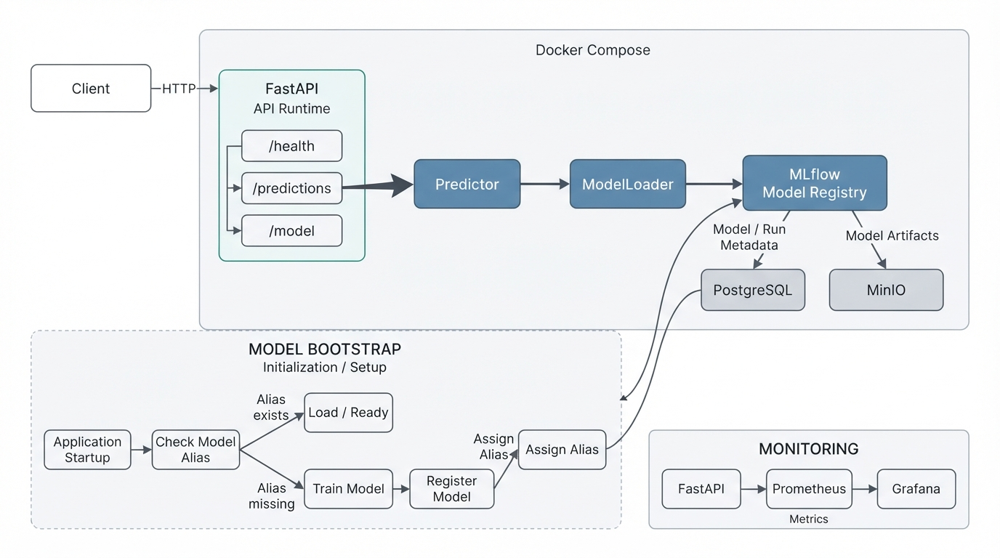
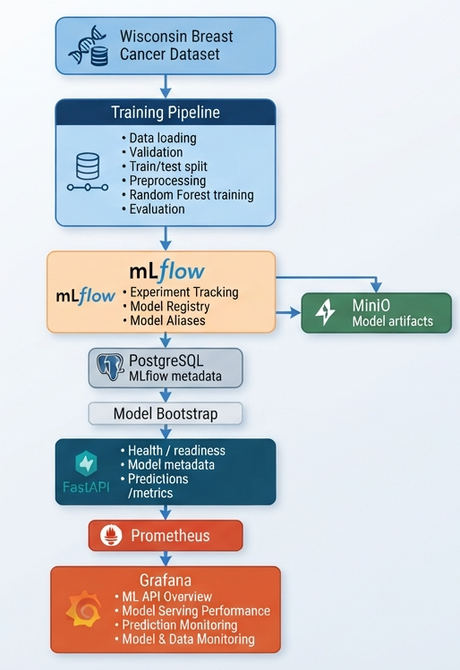
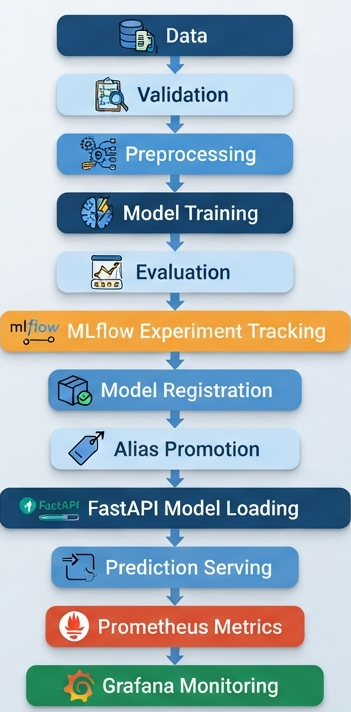
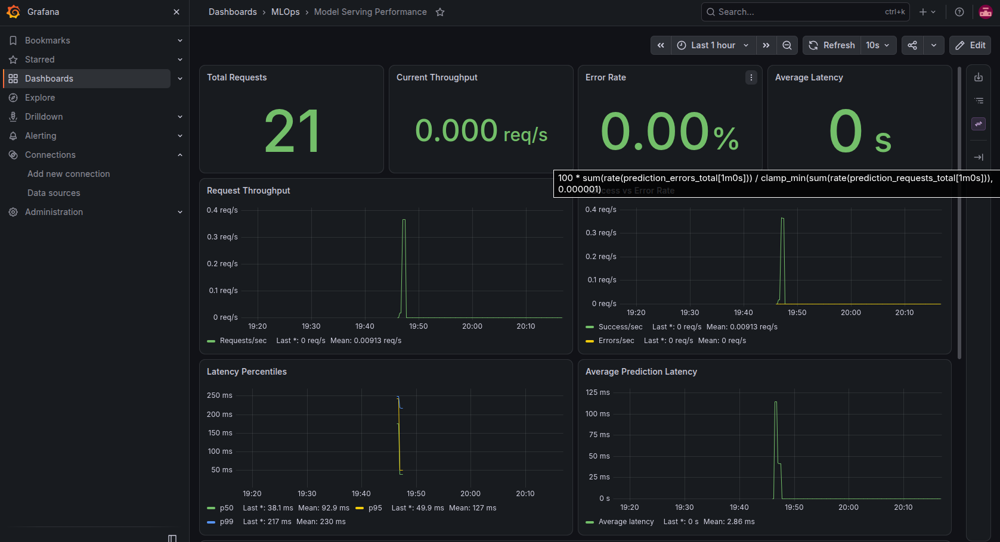
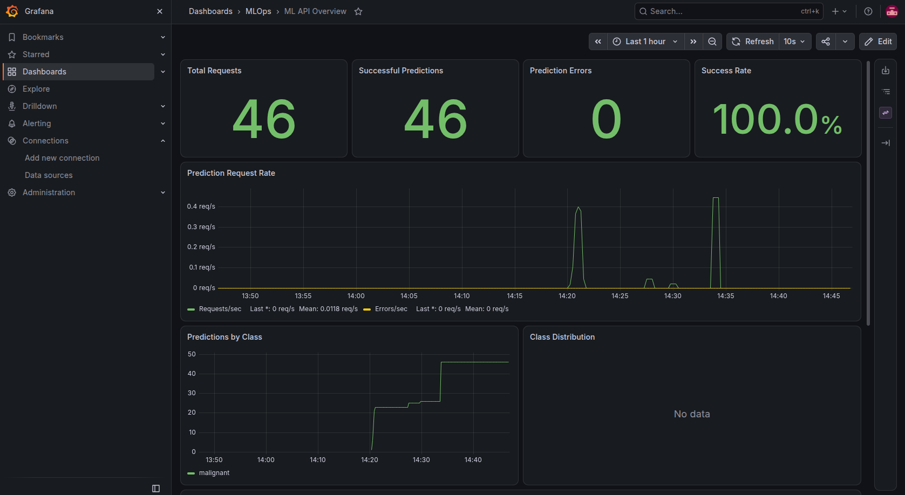
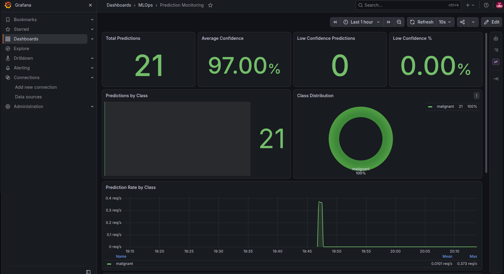
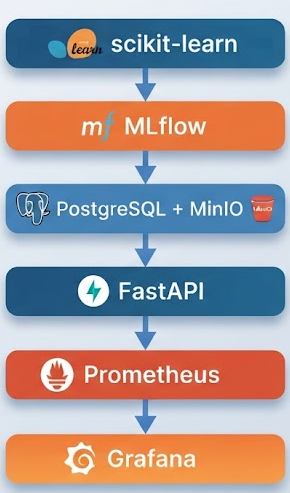

# Breast Cancer MLOps


[](https://mlflow.org/)


A production-oriented **end-to-end MLOps platform** for training,
registering, serving, testing, and monitoring a breast cancer
classification model using the Wisconsin Breast Cancer dataset.

The project combines a reproducible scikit-learn training pipeline with
MLflow experiment tracking and model registry, PostgreSQL metadata
storage, MinIO artifact storage, a versioned FastAPI inference API,
Prometheus metrics, provisioned Grafana dashboards, Docker Compose
orchestration, automated tests, and modern Python tooling with `uv` and
Ruff.

> **Important:** This project is an engineering and MLOps demonstration
> built on a public machine-learning dataset. It is **not intended for
> clinical diagnosis, treatment decisions, or medical use**.


<p align="left">
  
</p>


------------------------------------------------------------------------

## Table of Contents

-   [Project Overview](#project-overview)
-   [Architecture](#architecture)
-   [MLOps Lifecycle](#mlops-lifecycle)
-   [Features](#features)
-   [Technology Stack](#technology-stack)
-   [Project Structure](#project-structure)
-   [Installation](#installation)
-   [Usage](#usage)
-   [API Endpoints](#api-endpoints)
-   [MLflow Model Management](#mlflow-model-management)
-   [Monitoring](#monitoring)
-   [Testing and Code Quality](#testing-and-code-quality)
-   [CI/CD Pipeline](#cicd-pipeline)
-   [Deployment](#deployment)
-   [Development](#development)
-   [Project Limitations](#project-limitations)
-   [Contributing](#contributing)
-   [License](#license)
-   [Contact](#contact)

------------------------------------------------------------------------

## Project Overview

This project implements the complete lifecycle of a machine-learning
model, from dataset validation and model training to registry-based
promotion, API serving, automated testing, and operational monitoring.

The training pipeline loads and validates the Wisconsin Breast Cancer
dataset, performs preprocessing and train/test splitting, trains a
scikit-learn Random Forest classifier, evaluates the model, generates
evaluation artifacts, and records experiments with MLflow.

MLflow provides experiment tracking and model registry capabilities.
PostgreSQL is used for MLflow backend metadata, while MinIO provides
S3-compatible object storage for MLflow artifacts. Registered model
versions are promoted through a configurable model alias such as
`champion`.

The serving layer is implemented with FastAPI. At startup, the
application resolves the configured MLflow model alias, loads the
corresponding registered model into memory, and exposes versioned REST
endpoints for predictions, health checks, readiness, and model metadata.

The application also exposes Prometheus metrics for request activity,
errors, latency, prediction classes, confidence, input validation, and
active model metadata. Grafana is automatically provisioned with four
focused MLOps dashboards.

The complete local platform is orchestrated with Docker Compose and uses
`uv` for reproducible Python dependency management.


<p align="left">
  
</p>

------------------------------------------------------------------------

## Architecture

The platform separates the **training lifecycle**, **model registry and
artifact infrastructure**, **serving layer**, and **observability
stack**.


[mlflow-model-version](images/bcmlOps_architecture.png)

<br>

The application does not hard-code a model artifact path. Instead, it
resolves a registered MLflow model by alias, making model promotion
independent from the API code.

------------------------------------------------------------------------

## MLOps Lifecycle


<p align="left">
  
</p>


This architecture demonstrates the transition from model development to
an observable model-serving system rather than stopping at notebook
experimentation.

------------------------------------------------------------------------

## Features

-   **Data Pipeline:** Structured loading and validation of the
    Wisconsin Breast Cancer dataset.
-   **Model Training:** Scikit-learn Random Forest classifier with
    preprocessing, train/test splitting, evaluation, and reproducible
    training orchestration.
-   **Model Evaluation:** Classification metrics and generated
    evaluation artifacts including confusion matrix, ROC curve, feature
    importance, and other reports.
-   **Experiment Tracking:** MLflow records model parameters, metrics,
    runs, and artifacts.
-   **Model Registry:** Trained models are registered in MLflow and
    promoted using model aliases.
-   **Artifact Storage:** MinIO provides S3-compatible storage for
    MLflow model artifacts.
-   **Metadata Storage:** PostgreSQL stores MLflow tracking and registry
    metadata.
-   **Automatic Model Bootstrap:** The Docker Compose workflow can
    train/register a model and assign the configured alias when
    required.
-   **Prediction Serving:** FastAPI provides a versioned inference API
    with Pydantic request/response validation.
-   **Model Metadata:** Prediction responses expose the model name,
    alias, version, and run metadata.
-   **Prediction Probabilities:** The API returns class probabilities in
    addition to the predicted class.
-   **Health & Readiness:** Separate endpoints expose application health
    and model availability.
-   **Input Validation Monitoring:** Invalid prediction payloads are
    classified and counted by validation reason.
-   **Prediction Monitoring:** Prometheus records request volume,
    success/error counts, class distribution, latency, confidence, and
    low-confidence predictions.
-   **Model Monitoring:** Prometheus exposes information about the
    currently loaded MLflow model.
-   **Grafana Dashboards:** Four provisioned dashboards cover API
    health, serving performance, prediction behavior, and input/model
    monitoring.
-   **Testing:** Unit and integration tests validate inference behavior,
    API errors, confidence telemetry, and input-quality metrics.
-   **Modern Python Tooling:** `uv` manages dependencies and the virtual
    environment; Ruff provides linting and formatting.
-   **Containerization:** Docker and Docker Compose provide a
    reproducible local MLOps environment.
-   **Configuration:** Pydantic Settings and environment variables
    provide environment-based configuration.
-   **Logging:** Application logs cover startup, model
    resolution/loading, predictions, validation failures, and errors.

<br>


<br>

------------------------------------------------------------------------

## Technology Stack

### ML & Experiment Tracking

[](https://mlflow.org/)

### Infrastructure & Storage

[](https://www.docker.com/)
[](https://min.io/)
[](https://www.postgresql.org/)

### Monitoring

[](https://prometheus.io/)
[](https://grafana.com/)

  Component               Technology / Library
  ----------------------- ------------------------------------------
  Programming Language    Python 3.12
  Dependency Management   uv
  Linting / Formatting    Ruff
  Model Training          scikit-learn, Random Forest
  Data Processing         pandas, NumPy
  Experiment Tracking     MLflow
  Model Management        MLflow Model Registry, model aliases
  MLflow Metadata         PostgreSQL
  Artifact Storage        MinIO / S3-compatible storage
  API Framework           FastAPI, Pydantic
  API Server              Uvicorn
  Testing                 pytest, pytest-cov, HTTPX
  Metrics                 Prometheus Client
  Monitoring              Prometheus, Grafana
  Containerization        Docker, Docker Compose
  CI/CD                   GitHub Actions
  Configuration           Pydantic Settings, environment variables
  Logging                 Python logging

------------------------------------------------------------------------

## Project Structure

``` text
breast-cancer-mlops/
│
├── app/
│   ├── api/
│   │   ├── main.py
│   │   └── v1/
│   │       ├── router.py
│   │       └── endpoints/
│   │           ├── health.py
│   │           ├── metrics.py
│   │           ├── model.py
│   │           └── prediction.py
│   │
│   ├── core/
│   │   ├── config.py
│   │   ├── features.py
│   │   ├── logging.py
│   │   └── metrics.py
│   │
│   ├── schemas/
│   │   ├── health.py
│   │   ├── model.py
│   │   └── prediction.py
│   │
│   └── services/
│       ├── model_loader.py
│       └── predictor.py
│
├── training/
│   ├── data_loader.py
│   ├── validate.py
│   ├── split.py
│   ├── preprocess.py
│   ├── model.py
│   ├── train.py
│   ├── evaluate.py
│   ├── visualization.py
│   ├── mlflow_tracker.py
│   └── assign_model_alias.py
│
├── tests/
│   ├── unit/
│   │   └── test_predictor.py
│   └── integration/
│       └── test_prediction_api.py
│
├── monitoring/
│   ├── prometheus/
│   │   └── prometheus.yml
│   └── grafana/
│       ├── provisioning/
│       │   ├── datasources/
│       │   │   └── prometheus.yml
│       │   └── dashboards/
│       │       └── dashboards.yml
│       └── dashboards/
│           ├── ml-api-overview.json
│           ├── model-serving-performance.json
│           ├── prediction-monitoring.json
│           └── model-data-monitoring.json
│
├── notebooks/
│   └── exploratory_analysis.ipynb
│
├── reports/
│   ├── EDA_Report.md
│   ├── evaluation/
│   │   ├── classification_report.csv
│   │   ├── confusion_matrix.csv
│   │   ├── metrics.csv
│   │   └── plots/
│   │       ├── confusion_matrix.png
│   │       ├── feature_importance.png
│   │       ├── roc_curve.png
│   │       └── trees_vs_accuracy.png
│   ├── figures/
│   └── statistics/
│
├── mlflow/
│   └── Dockerfile
│
├── scripts/
│   └── docker_bootstrap_model.sh
│
├── .github/
│   └── workflows/
│       └── ci-cd.yml
│
├── Dockerfile
├── docker-compose.yml
├── pyproject.toml
├── uv.lock
├── .env.example
├── .gitignore
├── .dockerignore
├── README.md
└── LICENSE
```

------------------------------------------------------------------------

## Installation

### Prerequisites

-   Git
-   Docker
-   Docker Compose
-   `uv` for local Python development

Python 3.12 is managed according to the project's `pyproject.toml`.

### Quick Start with Docker

1.  Clone the repository:

``` bash
git clone https://github.com/fermat01/breast-cancer-mlops.git
cd breast-cancer-mlops
```

2.  Create the environment configuration:

``` bash
cp .env.example .env
```

Review the generated `.env` file and configure the required local
credentials and service settings.

3.  Build and start the complete stack:

``` bash
docker compose up -d --build
```

4.  Check the running containers:

``` bash
docker compose ps
```

5.  Main local services:

  Service              URL
  -------------------- ---------------------------------
  FastAPI              `http://localhost:8001`
  Swagger UI           `http://localhost:8001/docs`
  Prometheus Metrics   `http://localhost:8001/metrics`
  MLflow               `http://localhost:5000`
  Prometheus           `http://localhost:9090`
  Grafana              `http://localhost:3000`
  MinIO API            `http://localhost:9010`
  MinIO Console        `http://localhost:9011`

PostgreSQL is used internally by the Docker Compose network for MLflow
metadata and does not need to be exposed as a host service.

6.  Verify application health:

``` bash
curl http://localhost:8001/api/v1/health
```

7.  Verify model readiness:

``` bash
curl http://localhost:8001/api/v1/health/ready
```

A ready service reports that the ML model has been successfully loaded.

------------------------------------------------------------------------

## Usage

### Prediction

Predictions are created through:

``` text
POST /api/v1/predictions
```

The request must contain exactly 30 numerical features in the same order
used during training.

``` bash
curl -X POST http://localhost:8001/api/v1/predictions \
  -H "Content-Type: application/json" \
  -d '{
    "features": [
      17.99,
      10.38,
      122.8,
      1001.0,
      0.1184,
      0.2776,
      0.3001,
      0.1471,
      0.2419,
      0.07871,
      1.095,
      0.9053,
      8.589,
      153.4,
      0.006399,
      0.04904,
      0.05373,
      0.01587,
      0.03003,
      0.006193,
      25.38,
      17.33,
      184.6,
      2019.0,
      0.1622,
      0.6656,
      0.7119,
      0.2654,
      0.4601,
      0.1189
    ]
  }'
```

Example response:

``` json
{
  "prediction": 0,
  "prediction_label": "malignant",
  "probabilities": {
    "malignant": 0.97,
    "benign": 0.03
  },
  "model_name": "breast-cancer-classifier",
  "model_alias": "champion",
  "model_version": "1",
  "model_run_id": "<mlflow-run-id>"
}
```

### Interactive API Documentation

FastAPI provides Swagger UI at:

``` text
http://localhost:8001/docs
```

Use Swagger UI to inspect the request schema and execute prediction
requests directly from the browser.

### Prometheus Metrics

``` bash
curl http://localhost:8001/metrics
```

------------------------------------------------------------------------

## API Endpoints

  ------------------------------------------------------------------------
  Method                  Endpoint                 Description
  ----------------------- ------------------------ -----------------------
  `GET`                   `/`                      Service metadata and
                                                   useful links

  `GET`                   `/api/v1/health`         Application health

  `GET`                   `/api/v1/health/ready`   Readiness and model
                                                   availability

  `GET`                   `/api/v1/model`          Loaded MLflow model
                                                   information

  `POST`                  `/api/v1/predictions`    Generate a breast
                                                   cancer classification
                                                   prediction

  `GET`                   `/metrics`               Prometheus metrics
  ------------------------------------------------------------------------

`/api/v1/predictions` intentionally accepts `POST`, not `GET`, because
inference requires a validated request payload containing the model
features.

------------------------------------------------------------------------

## MLflow Model Management

MLflow is used for both experiment tracking and model lifecycle
management.

The training workflow records experiments and model artifacts, registers
trained models in the MLflow Model Registry, and uses a model alias such
as `champion` to identify the version intended for serving.

The FastAPI application resolves the configured alias during startup and
loads that registered model into memory.

``` text
Training
   ↓
MLflow Run
   ↓
Model Registration
   ↓
Model Version
   ↓
Alias: champion
   ↓
FastAPI Model Loader
   ↓
Prediction API
```

The serving layer also exports the active model name, alias, and version
through Prometheus, allowing the deployed model identity to be visible
in Grafana.


<p align="left">
  
</p>

------------------------------------------------------------------------

## Monitoring

The observability layer combines **Prometheus application metrics** with
**Grafana dashboards**.

Prometheus scrapes:

``` text
http://fastapi:8000/metrics
```

inside the Docker network. From the host, metrics are available at:

``` text
http://localhost:8001/metrics
```

### Available Metrics

Core serving metrics include:

-   `prediction_requests_total` --- prediction requests that reach the
    prediction service.
-   `prediction_success_total` --- successful predictions.
-   `prediction_errors_total` --- failed prediction operations.
-   `prediction_latency_seconds` --- prediction latency histogram.
-   `predictions_by_class_total{class_label=...}` --- predictions
    grouped by class.
-   `prediction_confidence` --- histogram of prediction confidence
    values.
-   `low_confidence_predictions_total` --- predictions below the
    configured observability confidence threshold.
-   `invalid_inputs_total{reason=...}` --- requests rejected by input
    validation.
-   `model_info{model_name=..., model_alias=..., model_version=...}` ---
    currently loaded MLflow model.
-   Standard Python/process metrics exported by the Prometheus client.

Input validation telemetry currently distinguishes reasons including:

``` text
feature_count
invalid_type
missing_field
```

The confidence threshold is used for **operational observability only**.
It is not a clinical decision threshold.


<p align="left">
  
</p>

### Grafana Dashboards

Grafana is provisioned automatically with a Prometheus datasource and
four dashboards:

#### 1. ML API Overview

High-level operational view of:

-   total requests
-   successful predictions
-   prediction errors
-   success rate
-   request rate
-   predictions by class
-   class distribution
-   prediction latency percentiles
-   loaded MLflow model

#### 2. Model Serving Performance

Focuses on inference-service behavior:

-   throughput
-   error rate
-   average latency
-   p50 / p95 / p99 latency
-   cumulative requests
-   successful/error request activity
-   active MLflow model

#### 3. Prediction Monitoring

Focuses on prediction behavior:

-   total predictions
-   average prediction confidence
-   low-confidence predictions
-   low-confidence percentage
-   predictions by class
-   class distribution
-   prediction rate by class
-   confidence percentiles
-   confidence distribution

#### 4. Model & Data Monitoring

Focuses on model identity and input-quality telemetry:

-   total invalid inputs
-   invalid input rate
-   successful predictions
-   observed input quality
-   invalid inputs by reason
-   invalid input distribution
-   validation activity over time
-   valid versus invalid request activity
-   active MLflow model

The project intentionally does **not** label these metrics as
statistical data drift. True drift detection requires
reference-versus-production feature-distribution monitoring, which is
outside the current implementation.


<p align="left">
  
</p>


### Monitoring Architecture

``` text
FastAPI
   │
   │ /metrics
   ▼
Prometheus
   │
   │ datasource
   ▼
Grafana
   ├── ML API Overview
   ├── Model Serving Performance
   ├── Prediction Monitoring
   └── Model & Data Monitoring
```


<p align="left">
  
</p>


------------------------------------------------------------------------

## Testing and Code Quality

The project includes unit and integration tests covering the
model-serving path and observability instrumentation.

Current coverage includes:

-   prediction generation
-   feature-count validation
-   probability extraction
-   model metadata
-   unavailable-model handling
-   unexpected inference failures
-   FastAPI request validation
-   invalid feature counts
-   invalid feature types
-   missing features
-   prediction confidence telemetry
-   low-confidence prediction telemetry
-   invalid-input metrics

Run the complete test suite:

``` bash
uv run pytest -q
```

Run unit tests:

``` bash
uv run pytest tests/unit -q
```

Run integration tests:

``` bash
uv run pytest tests/integration -q
```

### Ruff

Lint the project:

``` bash
uv run ruff check .
```

Check formatting:

``` bash
uv run ruff format --check .
```

Apply formatting:

``` bash
uv run ruff format .
```

A typical local quality check is:

``` bash
uv run ruff check .
uv run ruff format --check .
uv run pytest -q
```

------------------------------------------------------------------------

## CI/CD Pipeline

GitHub Actions provides automated CI/CD workflow support for the
repository.

The workflow is intended to validate changes automatically before
integration and provides the foundation for container-image publishing
and deployment automation.

The exact deployment behavior is defined in:

``` text
.github/workflows/ci-cd.yml
```

Local development and testing do not require cloud infrastructure.

> Cloud deployment targets such as Amazon ECR and ECS/Fargate should
> only be considered part of the implemented deployment path when the
> corresponding workflow and infrastructure are configured and enabled.

------------------------------------------------------------------------

## Deployment

### Current Deployment Status

The project is fully containerized and runs locally as a multi-service
MLOps platform with Docker Compose.

The stack includes:

-   FastAPI prediction API
-   model bootstrap workflow
-   MLflow Tracking Server and Model Registry
-   PostgreSQL MLflow backend
-   MinIO S3-compatible artifact storage
-   Prometheus
-   Grafana
-   automatically provisioned Grafana datasource and dashboards
-   persistent Docker volumes
-   automated tests and code-quality tooling
-   GitHub Actions workflow support

### Local Deployment

Start the complete stack:

``` bash
docker compose up -d --build
```

Check status:

``` bash
docker compose ps
```

Stop the stack:

``` bash
docker compose down
```

To also remove persistent local volumes:

``` bash
docker compose down -v
```

Use the last command carefully because it removes persisted local
PostgreSQL, MinIO, and Grafana data associated with the Compose project.

### Production Direction

The containerized architecture provides a foundation for deployment to
cloud container infrastructure. Production deployment would additionally
require environment-specific infrastructure, managed secrets, TLS,
authentication/authorization, backup strategy, resource limits, scaling
policies, and production-grade operational controls.

------------------------------------------------------------------------

## Development

### Install Dependencies with uv

Synchronize the project environment from `pyproject.toml` and `uv.lock`:

``` bash
uv sync
```

### Run FastAPI Locally

With the required supporting services and environment configuration
available:

``` bash
uv run uvicorn app.api.main:app \
  --host 0.0.0.0 \
  --port 8001 \
  --reload
```

### Run Tests

``` bash
uv run pytest -q
```

### Run Quality Checks

``` bash
uv run ruff check .
uv run ruff format --check .
```

### Dependency Changes

Add a runtime dependency:

``` bash
uv add <package>
```

Add a development dependency:

``` bash
uv add --dev <package>
```

After dependency changes, commit both:

``` text
pyproject.toml
uv.lock
```

------------------------------------------------------------------------

## Project Limitations

This repository demonstrates **MLOps and software-engineering
practices**, not a clinical medical system.

Important limitations include:

-   The model is trained on the Wisconsin Breast Cancer dataset for
    educational and engineering purposes.
-   The API is not intended to provide medical diagnoses.
-   Prediction confidence is monitored operationally and must not be
    interpreted as clinical certainty.
-   The configured low-confidence threshold is an observability
    threshold, not a medical threshold.
-   Statistical production data-drift detection is not currently
    implemented.
-   Production authentication, authorization, TLS termination, and
    broader security controls would be required before exposing such a
    service publicly.
-   Production deployment requires infrastructure and operational
    controls beyond the local Docker Compose environment.

------------------------------------------------------------------------

## Contributing

Contributions are welcome.

1.  Fork the repository.
2.  Create a feature branch:

``` bash
git checkout -b feature/new-feature
```

3.  Make your changes.
4.  Run the quality checks:

``` bash
uv run ruff check .
uv run ruff format --check .
uv run pytest -q
```

5.  Commit your changes:

``` bash
git commit -m "feat: add new feature"
```

6.  Push the branch:

``` bash
git push origin feature/new-feature
```

7.  Open a Pull Request.

Please ensure all tests and code-quality checks pass before submitting a
pull request.

------------------------------------------------------------------------

## Conclusion

This project demonstrates an end-to-end MLOps lifecycle that moves
beyond model experimentation into reproducible training, model
registration, API serving, testing, containerization, and operational
observability.

The platform integrates:


<p align="left">
  
</p>


The result is a portfolio-oriented MLOps system demonstrating practical
skills across **machine learning engineering, model lifecycle
management, backend API development, testing, observability,
containerization, and modern Python engineering**.

------------------------------------------------------------------------

## License

This project is licensed under the MIT License. See the
[LICENSE](LICENSE) file for details.

------------------------------------------------------------------------

## Contact

For questions, feedback, or contributions, please open an issue in the
repository.